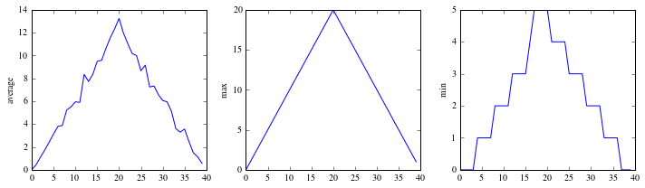

# Guide for organizing scientific projects

One of the challenges scientists face daily is how to organize and keep track of
complex research projects. In this lesson, we'll see how to apply the skills you
learnt in the workshop to organize a scientific project and produce reproducible
results.

This lesson is based on [this paper](http://www.ploscompbiol.org/article/info%3A
doi%2F10.1371%2Fjournal.pcbi.1000424#pcbi.1000424-Baxter1).

[This paper](http://www.nature.com/ismej/journal/v7/n3/full/ismej2012123a.html)
and [this other](http://www.nature.com/news/interactive-notebooks-sharing-the-
code-1.16261) are good examples of what you can achieve.

## Best practices

- Use a standard directory layout
- Use version control as much as you can
- Automate as much as you can
- Document each folder's contents in a ``README.md`` file
- Document procedures in notebooks

## Organizing your files

Plan your project ahead and structure your directory layout accordingly. Here we
will adapt the following structure:

#### Exercises

1. Create a project for a clinical study to test a new drug. You have two groups
of patients taking placebo or tylenol. You get a new file with inflammation data
for each group evey week. The project is called ``inflammation``. Decide the
folder layout and create the top folder structure.

2. Add a ``README.md`` at the top level to describe the project. Use a text
editor and Markdown.

3. Create a local git repo and upload it to github.

Let's change to the directory (you don't need to do this in your terminal):

    !pwd
    import os
    os.chdir('files/inflammation')

    /Users/ivan/Documents/swc/bootcamps/2014-11-07-harvard/novice/managing_projects

## Dealing with data

We will use the inflammation data from the python lesson. Collaborators send us
the files all mixed up. Files with odd number are tylenol, even placebo. We will
automate the addition of data to the project, so all files are renamed and put
under version control.

**Prep**

Download a clean copy of [the inflammation
data](http://iglpdc.github.io/2014-11-07-harvard/2014-11-07-harvard-python.zip)
to your Desktop.

#### Exercises

Create a notebook at the top level to do exploratory work and test stuff.

Using the notebook make a function that takes a file name and return a modified
string. If the number of the filename is odd, return "tylenol", of even return
"placebo". Write a test and a docstring for the function.

~~~bash
python assign_drug.py inflammation_1.dat
tylenol
python assign_drug.py inflammation_4.dat
placebo
~~~

*Hint* You can use slicing or the ``split()`` function for strings to have a
more general code. Use ``?`` to get help in the notebook.

Make a bash script that takes a date in yyyy-mm-dd format and a filename and
copies this file to a new folder 'yyyy-mm-dd' inside ``data/`` with a new name
made up with the date and the type of drug. The script has only echo the
commands to get this one, but run nothing:

~~~bash
bash add_data.sh 2014-11-07 inflammation_1.dat
cp inflammation_1.dat data/2014-11-07/2014-11-07-tylenol.dat
bash add_data.sh 2014-11-07 inflammation_2.dat
cp inflammation_1.dat data/2014-11-07/2014-11-07-placebo.dat
~~~

Put the script in ``bin/`` and commit.

Modify the script to add and commit automatically the new file. Use ``-m``
option for commit to write a meaningful message:

~~~bash
bash add_data.sh 2014-11-07 inflammation_2.dat
File committed to the repo: "Add new data file for placebo on 2014-11-07"
~~~

Commit the script when you're done.

This script won't work if the inflammation files are not in the same directory
where the script is. Improve the python script to be able to use a full path for
the inflammation file as the third argument. The function to strip off the
filename from a full path is ``os.path.basename()``. Note that you have to
import the module ``os`` to be able to use it. To figure out how to use it, run
``help(os.path.basename())`` on the notebook.

A possible implementation of the python script is:

    !cat src/assign_drug.py

    import os 
    import sys
    
    def assign_drug(filepath):
        '''Assigns a drug to a filename '''
        filename = os.path.basename(filepath)
        number = filename[13:-4]
        # the above line is error-prone: say someone misspells inflammation so it
        # has less that 13 characters...
        # A more robust funtion uses the Python's split() function for strings:
        #
        # filename_without_ext = filename.split('.')[0]
        # number = filename_without_ext.split('_')[1]
        result = ''
        if (int(number) % 2) == 1:
            result = 'tylenol'
        else:
            result = 'placebo'
        return result
    
    
    filename = sys.argv[1] 
    print assign_drug(filename)
        
    assert assign_drug("inflammation_1.dat") == "tylenol" 
    assert assign_drug("inflammation_4.dat") == "placebo" 
    assert assign_drug("inflammation_3.dat") == "tylenol"
    # test for numbers starting with zeroes
    assert assign_drug("inflammation_04.dat") == "placebo" 
    # test for full paths
    assert assign_drug("/somewhere/in/your/disk/inflammation_03.dat") == "tylenol"

A possible implementation of the bash script is:

    !cat src/add_data.sh

    DRUG=$(python assign_drug.py $2)
    DEST=$3/$1/$1-$DRUG.dat
    mkdir -p $3/$1
    cp $2 $DEST
    git add $DEST
    MSG="Add file $DEST"
    git commit -m "'$MSG'"
    echo "New file added to the repo: $DEST"

Let's add four files pretending is data for the two days of the workshop:

    src/add_data.sh 2014-11-07 ~/Desktop/inflammation_01.cvs data
    src/add_data.sh 2014-11-07 ~/Desktop/inflammation_02.cvs data
    src/add_data.sh 2014-11-08 ~/Desktop/inflammation_03.cvs data
    src/add_data.sh 2014-11-08 ~/Desktop/inflammation_04.cvs data

Now:

    !ls data/*
    !pwd

    data/2014-11-07:
    2014-11-07-placebo.dat 2014-11-07-tylenol.dat
    
    data/2014-11-08:
    2014-11-08-placebo.dat 2014-11-08-tylenol.dat
    /Users/ivan/Documents/swc/bootcamps/2014-11-07-harvard/novice/managing_projects/files/inflammation

You repo should look something like this:

~~~bash
git log --graph --decorate --pretty=oneline --abbrev-commit

* e22c112 (HEAD, origin/master, master)Add file
../data/2014-11-07/2014-11-08-tylenol.dat
* 01a2a88 Add file ../data/2014-11-07/2014-11-08-placebo.dat
* a78b89f Add file ../data/2014-11-07/2014-11-07-tylenol.dat
* aec9768 Add file ../data/2014-11-07/2014-11-07-placebo.dat
* 79e8824 Add bash script to add data.
* 0d00f07 Add documentation to function.
* 5e5f0c0 Add script to assing drug
* 9acf832 Add gitignore
* 667808b Add script to assign drug
* ac1ab14 Initial commit
~~~

## Dealing with code

Let's use the code we created yesterday to analyze the inflammation data. Copy
the code into your scratch notebook.

    %matplotlib inline
    import numpy as np
    from matplotlib import pyplot as plt
    
    data = np.loadtxt(fname='inflammation-01.csv', delimiter=',')
    
    plt.figure(figsize=(10.0, 3.0))
    
    plt.subplot(1, 3, 1)
    plt.ylabel('average')
    plt.plot(data.mean(0))
    
    plt.subplot(1, 3, 2)
    plt.ylabel('max')
    plt.plot(data.max(0))
    
    plt.subplot(1, 3, 3)
    plt.ylabel('min')
    plt.plot(data.min(0))
    
    plt.tight_layout()
    plt.show()

##### Prep

- run the scratch notebook and get sure all works. A good idea is to
stop/restart the kernel before  to clean up what's in the notebook's memory (see
the "Kernel" tab on the notebook toolbar).
- run all the cells

#### Exercise

Modify the code to make function called analyze that takes a date in yyyy-mm-dd
format and saves the plot as a pdf file into the results folder. Apart for
saving the file, the function should print a message.

~~~bash
analyze_inflammation(2014-11-07-tylenol.dat)
Plotting result in ./result/2014-11-07-tylenol.pdf
~~~

A possible implementation is:

    import os
    import numpy as np
    from matplotlib import pyplot as plt
    
    def make_filename_for_plot(filename):
        '''Makes a filename for the plot given the data filename
        
        Parameters
        ----------
            filename: str
                 Path to the file for data to analyze. Can be relative or absolute.
        '''    
        filename = os.path.abspath(filename)
        plot_filename = os.path.basename(filename)[:-4] + '.pdf'
        data_dir = os.path.dirname(os.path.dirname(os.path.abspath(filename)))
        results_dir = os.path.join(os.path.dirname(data_dir), 'results')
        return os.path.join(results_dir, plot_filename)
    
    def analyze_inflammation(filename):
        '''Makes a plot of average, min, and max
        
        Parameters
        ----------
            filename: str
                 Path to the file for data to analyze. Can be relative or absolute.
        '''
        filename = os.path.abspath(filename)
        data = np.loadtxt(fname=filename, delimiter=',')
    
        plt.figure(figsize=(10.0, 3.0))
    
        plt.subplot(1, 3, 1)
        plt.ylabel('average')
        plt.plot(data.mean(0))
    
        plt.subplot(1, 3, 2)
        plt.ylabel('max')
        plt.plot(data.max(0))
    
        plt.subplot(1, 3, 3)
        plt.ylabel('min')
        plt.plot(data.min(0))
    
        plt.tight_layout()
        
        filename_for_plot = make_filename_for_plot(filename)
        plt.savefig(filename_for_plot)
        
        print('Plotting result in ' + filename_for_plot)
        
    analyze_inflammation('data/2014-11-07/2014-11-07-tylenol.dat')

    Plotting result in /Users/ivan/Documents/swc/bootcamps/2014-11-07-harvard/novice/managing_projects/files/inflammation/results/2014-11-07-tylenol.pdf

### Making a script out of a notebook

You can save the notebook as a python script that we can run from the terminal.
From the terminal run:

~~~bash
ipython nbconvert --to python scratch.ipynb
~~~

Check out that a new file was created:

~~~bash
ls src/*.py
~~~

Rename the script to ``analyze_inflammation.py`` and commit.

### Python script with arguments

The script above is not ready to take arguments from the command line.

#### Exercises

Modify the code to take an argument to analyze the data for a particular date
and saves the plot into results.

~~~bash
python analyze_inflammation.py ./data/2014-11-07/2014-11-07-tylenol.dat
Plotting result in ./result/2014-11-07-tylenol.pdf
~~~

## Adding a feature to your code

Once your analysis is working, you should be careful that new code doesn't break
existing code. A workflow commonly uses the branching features of git.

``git`` allows you to keep several histories in parallel, called branches. The
default history/branch is called ``master`` and is the only we have now in our
inflammation repo. Let's add a new feature to the code: documentation for the
scripts.

First, let's check our repo's branches:

~~~bash
cd inflammation/src
git branch
* master
~~~

Create a new branch called ``document-scripts-properly``:

~~~bash
git checkout -b document-scripts-properly
~~~

This creates and switches to a new branch 'document-scripts-properly' which has
the same contents as you had in the working directory.

~~~bash
* document-scripts-properly
  master
~~~

Let's add some documentation about the arguments of the ``analyze_inflammation-
py`` script and make a couple of new commits:

~~~bash
nano analyze_inflammation.py
git add analyze_inflammation.py
git commit -m "Add documentation about the script arguments"
nano analyze_inflammation.py
git add analyze_inflammation.py
git commit -m "Add documentation about usage"
~~~

These two commit were made in the ``document-scripts-properly`` branch. If we
need to we can go back any time to the ``master`` branch which is in the same
state as when we created the ``document-scripts-properly`` branch. This allows
to make changes to the code without interfering with the ``master`` branch,
which is always in a good working state. After our work in the ``document-
scripts-properly`` branch are finished and tested, we can incorporate the
changes by merging together the two branches:

~~~bash
git checkout master
git merge document-scripts-properly
~~~

## Reproducing the project

Ideally, we should be able to reproduce all the results of the project as
automatically as possible. One way to do this is to have a script sitting right
under the project directory that just calls all the other scripts to do the
analysis.

``make`` is a program often use to do this. ``make`` looks for a file called
``Makefile`` in which you specify all the steps to reproduce the project and its
dependencies.

An simple ``Makefile`` for this project is this:

    !cat Makefile

    analyze:
    	for i in data/*/*.dat; do python src/analyze_inflammation.py i; done;
    
    clean:
    	rm results/*.pdf
    
    all: clean, analyze

The ``Makefile`` is divided in sections. Each section start with a word followed
by a semicolon. This word is called a target. After the line with the target,
you write the commands that will be executed upon calling this target. E.g,
entering this command in the shell:

~~~~bash
make analyze
~~~

will execute to:

~~~bash
for i in data/*/*.dat; do python src/analyze_inflammation.py i; done;
~~~

Targets can have dependencies, so when such target is called, its dependencies
are executed. E.g.:

~~~bash
make all
~~~

will expand to:

~~~bash
rm results/*.pdf
for i in data/*/*.dat; do python src/analyze_inflammation.py i; done;
~~~

Therefore, to reproduce the results of this project from scratch in any computer
we need to enter only two commands in the shell:

~~~bash
git clone [URL from Github] .
make all
~~~

## Running your code in Odyssey

#### Clone your repo to the cluster

~~~bash
ssh iglpdc@login.rc.fas.harvard.edu
mkdir inflammation
cd inflammation
git clone [clone link from Github] .
~~~

Note the dot at the end of the last command.

#### Get an interactive session

The login node shouldn't be used to run computation, so let's move to a
computing node. Note that our home folder gets mounted there automatically, i.e.
no need to clone the repo again in the node.

~~~bash
srun --pty --mem=4000 -t 0-6:00 -p interact /bin/bash
~~~

Make note of hostname that appears in the prompt after the ``@`` symbol (e.g.
holy2a18304). The computing nodes do not include much software and we have to
manually "install" python using these commands.

~~~bash
source new-modules.sh
module load python
~~~

You should be able to run python and IPython now in the command line. Try with:

~~~bash
ipython --version
~~~

#### Run a notebook in the cluster, interact with it from your laptop

If you want to use the notebook though, you need an extra step to be able to see
the notebook in your browser.

##### Open another terminal

~~~bash
ssh -L 8888:holy2a18304:8888 login.rc.fas.harvard.edu
~~~

where you instead of hostname you must use the hostname from above, e.g.
holy2a18304. This just tunnels the notebook webpages from the computing node
throught the login node to your laptop.

##### Run the IPython notebook in the node

~~~bash
cd inflammation/src
ipython notebook
~~~

##### Open new web browser window in your laptop and go to http://localhost:8888

You should be able to see your notebooks. Note that now the node is the computer
running the calculations: your laptop is just displaying them. This a good way
to do visualizations or exploratory analysis that requires more computing power
than what your laptop can offer.

